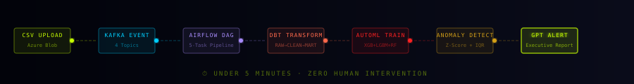

<!-- ANIMATED SVG HEADER -->
<div align="center">

</div>

<!-- TYPING ANIMATION -->
<div align="center">

</div>

<br/>

<div align="center">

[](https://www.linkedin.com/in/momna-ali)
[](https://momna-bit.github.io/nexaiq-portfolio)
[](https://momna-bit.github.io/Nexaiq)
[](mailto:alimomna87@gmail.com)
[](https://github.com/Momna-bit)

</div>

---

## 🧠 About Me

```python
class MomnaAli:
    name       = "Momna Ali"
    location   = "Toronto, Ontario, Canada 🇨🇦"
    education  = "MSc Data Science & Analytics — Toronto Metropolitan University"
    currently  = "Building NexaIQ — Autonomous Data Intelligence Platform"
    seeking    = ["Data Engineer", "ML Engineer", "AI Engineer",
                  "Data Scientist", "Data Analyst"]
    stack      = ["Python", "FastAPI", "Kafka", "Airflow", "DBT", "MLflow",
                  "LangGraph", "RAG", "ChromaDB", "Azure", "Docker", "K8s"]
    achievements = {
        "NexaIQ"        : "7 microservices · 4 AI agents · Production B2B SaaS",
        "InsureIQ"      : "Fraud detection XGBoost AUC 1.0",
        "ICU Cardiac AI": "Real-time cardiac risk · Live on Railway",
        "Healthcare ML" : "CKD prediction 94% AUC",
        "AI Guardian"   : "Accessibility AI · 95% accuracy",
        "Technovation"  : "Mentored team to Top 10% globally"
    }
    def mission(self): return "I build production systems. Not just notebooks. 🚀"
```

---

## 🏆 Achievements

<div align="center">

| 🚀 | 🛡️ | 🏥 | 🧬 | 🌍 | 📊 |
|---|---|---|---|---|---|
| **NexaIQ** | **InsureIQ** | **ICU Cardiac AI** | **Healthcare ML** | **Technovation** | **MLflow** |
| 7 Microservices · 4 AI Agents | XGBoost AUC 1.0 | Real-time Cardiac Risk | CKD Prediction 94% AUC | Top 10% Globally | 61 Experiment Runs |

</div>

---

## 🚀 NexaIQ — Animated Pipeline

<div align="center">

</div>

<div align="center">

[](https://momna-bit.github.io/nexaiq-portfolio)
[](https://momna-bit.github.io/Nexaiq)
[](https://github.com/Momna-bit/Nexaiq)

</div>

---

## 📊 GitHub Stats

<div align="center">


</div>

<div align="center">


</div>

---


---

## 📈 Activity Graph

<div align="center">

[](https://github.com/Momna-bit)

</div>

---

## 🧪 Skills & Expertise

<div align="center">

<!-- ANIMATED SKILL BARS SVG -->


</div>

---

## 📂 Projects

<div align="center">

| 🏷️ | Project | What it does | Stack | Links |
|---|---------|-------------|-------|-------|
| 🚀 | **NexaIQ** | Autonomous Data Intelligence — CSV to AI report in <5 min | Kafka · Airflow · DBT · MLflow · LangGraph · React | [](https://momna-bit.github.io/Nexaiq) [](https://github.com/Momna-bit/Nexaiq) |
| 🛡️ | **InsureIQ** | AI fraud detection — Claude AI + XGBoost **AUC 1.0** | Claude AI · XGBoost · Snowflake · ChromaDB · Docker | [](https://momna-bit.github.io/insureiq) [](https://github.com/Momna-bit/insureiq) |
| 🏥 | **ICU Cardiac AI** | Real-time cardiac risk monitoring for ICUs | FastAPI · XGBoost · Docker · K8s · Prometheus | [](https://github.com/Momna-bit/icu-cardiac-ai-prod) |
| 📊 | **Customer Ops Platform** | Multi-cloud data — AWS S3 + Azure → Snowflake → Power BI | Snowflake · AWS · Azure · Power BI · SQL | [](https://github.com/Momna-bit/customer-ops-platform) |
| 🛒 | **Retail CLV Analytics** | Customer lifetime value — segmentation & forecasting | Python · SQL · scikit-learn | [](https://github.com/Momna-bit/retail-clv-analytics) |
| 📈 | **A/B Testing + Power BI** | Statistical testing framework with Power BI reporting | Python · Power BI · Statistics | [](https://github.com/Momna-bit/A-B-Testing-PowerBI-Project) |
| 🤖 | **AI Guardian** | AI accessibility system — **95% accuracy** | Python · AI · Computer Vision | [](https://github.com/K2hmed/Ai-Guardian) |
| 🏭 | **MRP System** | Manufacturing resource planning & demand forecasting | Python · SQL | [](https://github.com/Momna-bit/MRP) |

</div>

---

## 🛠️ Tech Stack

<div align="center">

**Languages**


**Data Engineering**


**ML / MLOps**


**AI / GenAI**


**Cloud & DevOps**


**Visualisation**


</div>

---

## 🎓 Education & Certifications

| Degree | Institution | Year |
|--------|------------|------|
| **MSc Data Science & Analytics** | Toronto Metropolitan University | 2024 – 2025 |
| **BSc Computer Science** | SZABIST Dubai | 2020 – 2024 |

<div align="center">


</div>

---

## 🏆 Key Achievements

<div align="center">

[](https://github.com/Momna-bit/Nexaiq)
[](https://github.com/Momna-bit/insureiq)
[](https://github.com/Momna-bit/icu-cardiac-ai-prod)
[](#)
[](#)
[](#)

</div>

---

## 📍 Currently

```
🔨  Building    →  NexaIQ — Autonomous Data Intelligence Platform
🎯  Seeking     →  Data Engineer | ML Engineer | AI Engineer
                   Data Scientist | Data Analyst (Canada 🇨🇦)
📚  Learning    →  Advanced LangGraph · Azure Deployment · Vector DBs
💬  Open to     →  Full-time roles · Collaborations · Interesting problems
📍  Location    →  Toronto, Ontario, Canada
```

---

<div align="center">

[](https://www.linkedin.com/in/momna-ali)
[](https://momna-bit.github.io/nexaiq-portfolio)


*⭐ Star my repos if you find them interesting!*

</div>
